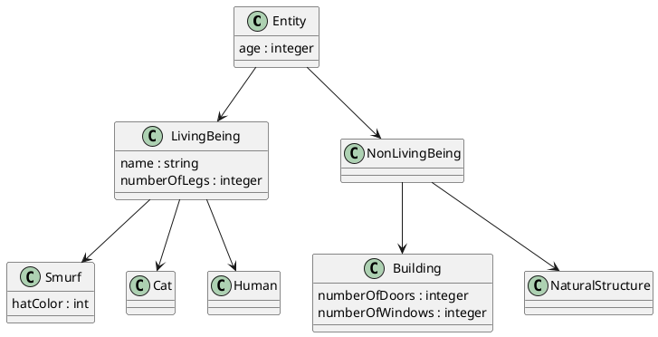
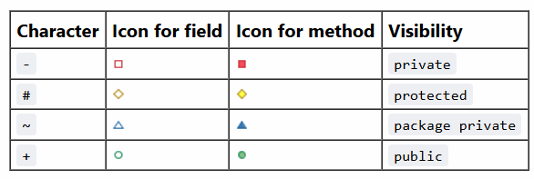

# SmurfVillage

```plantuml
@startuml

class Entity {
    age : integer
}

class LivingBeing{
    name : string
    numberOfLegs : integer
}

class Smurf {
    hatColor : int
}

class Cat {

}

class Human {

}

class NonLivingBeing {

}

class Building {
    numberOfDoors : integer
    numberOfWindows : integer
}

class NaturalStructure {

}

Entity --> LivingBeing
Entity --> NonLivingBeing

LivingBeing --> Smurf
LivingBeing --> Cat
LivingBeing --> Human

NonLivingBeing --> Building
NonLivingBeing --> NaturalStructure

@enduml
```

