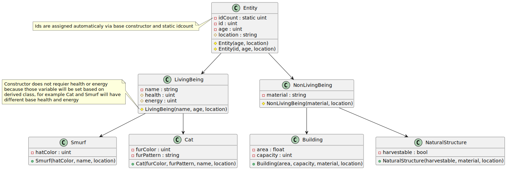

# SmurfVillage

Any color variables can be later replace with Color class, for now colors are stored as three 8 bit value in order from G B R from least significant bit.

For most string variables can be replace by dedicated class.

more classes can be derived from LivingBeing and NonLivingBeing like Human or Items. From Smurf class more specific smurf classes can be derived like leader smurf or worker smurf.

