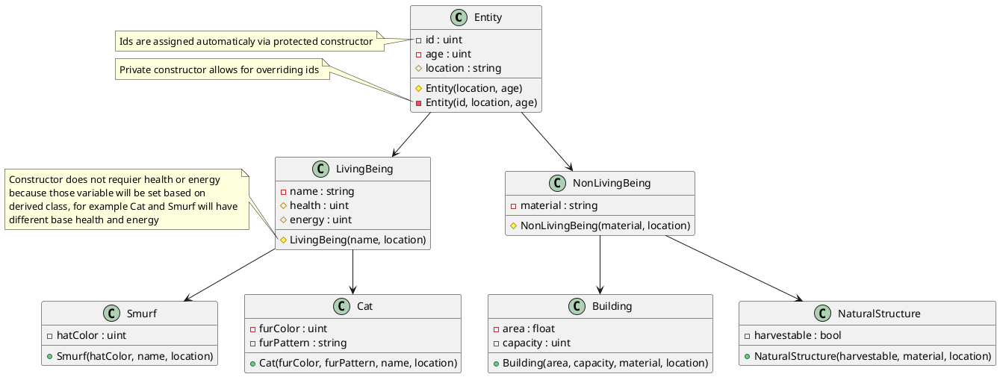

# SmurfVillage

Any color variables can be later replace with Color class, for now colors are stored as three 8 bit value in order from G B R from least significant bit.

For most string variables, string type is temporary, to be replace by dedicated class

