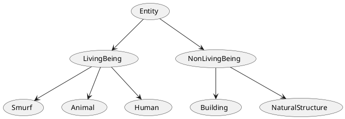

# SmurfVillage

```plantuml
@startuml test

(Entity) --> (LivingBeing)
(Entity) --> (NonLivingBeing)

(LivingBeing) --> (Smurf)
(LivingBeing) --> (Animal)
(LivingBeing) --> (Human)

(NonLivingBeing) --> (Building)
(NonLivingBeing) --> (NaturalStructure)


@enduml
```