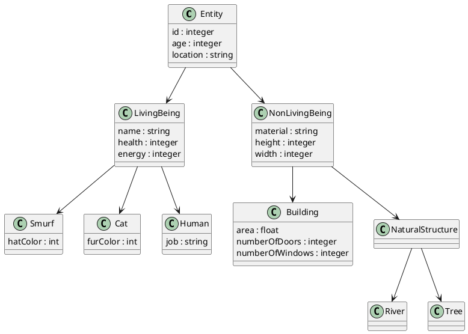

# SmurfVillage

```plantuml
@startuml

class Entity {
    id : integer
    age : integer
    location : string
}

class LivingBeing{
    name : string
    health : integer
    energy : integer
}

class Smurf {
    hatColor : int
}

class Cat {
    furColor : int
}

class Human {
    job : string
}

class NonLivingBeing {
    material : string
    height : integer
    width : integer
}

class Building {
    area : float
    numberOfDoors : integer
    numberOfWindows : integer
}

class NaturalStructure {

}

class River {

}

class Tree {

}

Entity --> LivingBeing
Entity --> NonLivingBeing

LivingBeing --> Smurf
LivingBeing --> Cat
LivingBeing --> Human

NonLivingBeing --> Building
NonLivingBeing --> NaturalStructure

NaturalStructure --> Tree
NaturalStructure --> River

@enduml
```

