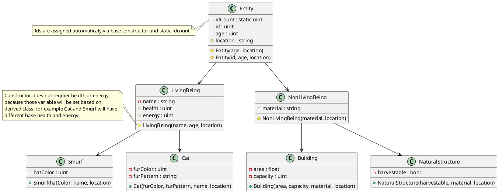

```plantuml
@startuml

class Entity {
    - idCount : static uint
    - id : uint
    - age : uint
    # location : string

    # Entity(age, location)
    # Entity(id, age, location)
}

note left of Entity::id
    Ids are assigned automaticaly via base constructor and static idcount
endnote

class LivingBeing{
    - name : string
    # health : uint
    # energy : uint

    # LivingBeing(name, age, location)
}

note left of LivingBeing::"LivingBeing(name, age, location)"
    Constructor does not requier health or energy
    because those variable will be set based on
    derived class, for example Cat and Smurf will have
    different base health and energy
endnote

class Smurf {
    - hatColor : uint

    + Smurf(hatColor, name, location)
}

class Cat {
    - furColor : uint
    - furPattern : string

    + Cat(furColor, furPattern, name, location)
}

class NonLivingBeing {
    - material : string

    # NonLivingBeing(material, location)
}

class Building {
    - area : float
    - capacity : uint

    + Building(area, capacity, material, location)
}

class NaturalStructure {
    - harvestable : bool

    + NaturalStructure(harvestable, material, location)
}

Entity --> LivingBeing
Entity --> NonLivingBeing

LivingBeing --> Smurf
LivingBeing --> Cat

NonLivingBeing --> Building
NonLivingBeing --> NaturalStructure

@enduml
```